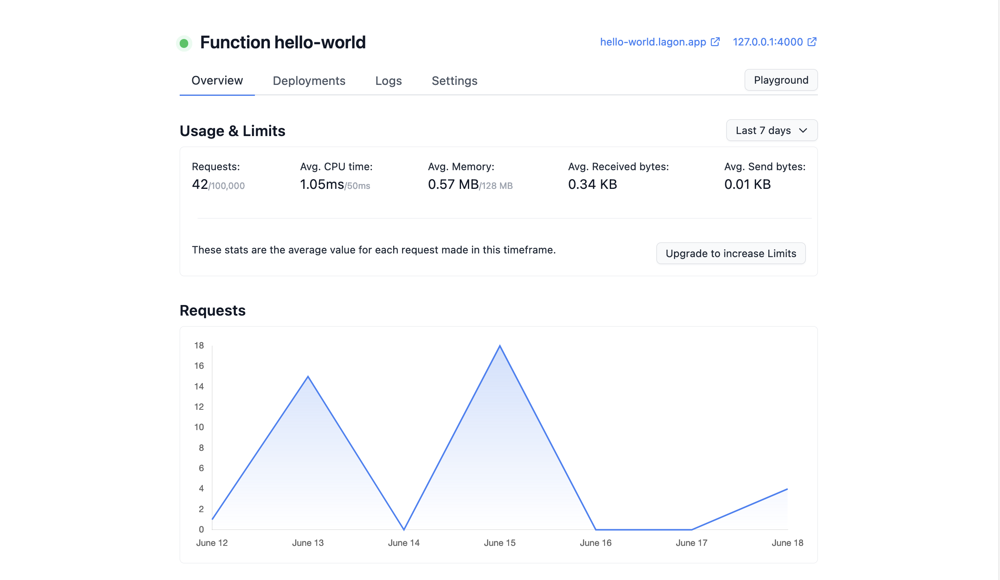

  <picture>
    <source media="(prefers-color-scheme: dark)" srcset="./assets/logo-white.png">
    <source media="(prefers-color-scheme: light)" srcset="./assets/logo-black.png">
    
  </picture>
  

    Deploy Serverless Functions at the Edge
     
     
    <a align="center" href="https://discord.lagon.app">
      💻 Join the Discord
    </a>
     
    <a align="center" href="https://tally.so/r/n9q1Rp">
      ✉️ Get email updates
    </a>
     
     
    Open Source • TypeScript • Web APIs
     
    Cron triggers • Instant deployments
     
    Interactive playground
  

## About

Lagon is a free Open Source Runtime and SaaS that make it easy to deploy TypeScript and JavaScript Serverless Functions at the Edge, using V8 Isolates. It's also self-hostable.

> **Warning**: Lagon is still in heavy development. Do not use for production usages.

Current status:

- **Dev**
- ~Alpha~
- ~Beta~
- ~General Availability~

## Packages

- **[runtime](./packages/runtime)** Rust JavaScript Runtime, using V8 Isolates
- **[js-runtime](./packages/runtime)** JavaScript code for the Runtime, containing the Web APIs
- **[cli](./packages/cli)** CLI to manage Functions
- **[docs](./packages/docs)** Documentation website
- **[serverless](./packages/serverless)** HTTP entrypoint for Functions, using the Runtime and exporting metrics
- **[website](./packages/website)** Dashboard and API
- **[www](./www)** Public website

## Planned features

- JavaScript Runtime based on V8 Isolates with Web APIs
- Deploy APIs, SSR(ed) websites, Webhooks endpoints, Cron jobs...
- CLI to manage Functions and run them locally
- Playground in the website
- Deploy at the Edge using the Cloud SaaS, or self-host it

## Roadmap

Lagon is a fairly recent project. It is still in heavy development, so expect breaking changes and buggy features.

[See the roadmap on GitHub](https://github.com/orgs/lagonapp/projects/1)

## How it works

Lagon uses V8 Isolates, which are sandboxed environments used to run plain JavaScript. That means each Function memory is isolated from each other and from the host. They are used behind the scene by [Node.js](https://nodejs.org/), [Electron](https://www.electronjs.org/), [Deno](https://deno.land/) (and [Deno Deploy](https://deno.com/deploy)), [Cloudflare Workers](https://workers.cloudflare.com/) and more.

V8 Isolates are very fast to start (faster than starting a whole Node.js process) and such allows to have a very low latency coupled with almost free cold-starts.

## License

[GNU AGPLv3](./LICENSE)
