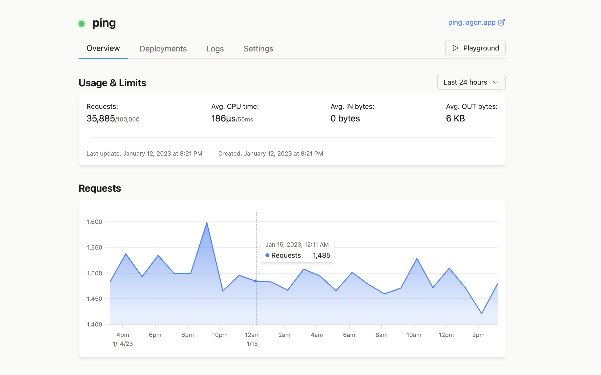

  <!--  -->
  <picture>
    <source media="(prefers-color-scheme: dark)" srcset="./assets/logo-white.png">
    <source media="(prefers-color-scheme: light)" srcset="./assets/logo-black.png">
    
  </picture>
  

    Deploy Serverless Functions at the Edge
     
     
    <a align="center" href="https://lagon.app">
      lagon.app
    </a>
     
     
    Open Source • TypeScript • Web APIs
     
    Cron triggers • Instant deployments
     
    Interactive playground
  

## About

Lagon is a free Open Source SaaS that make it easy to deploy TypeScript and JavaScript Serverless Functions at the Edge, using V8 Isolates. You can also self-host it (WIP).

> **Warning**: Lagon is still in heavy development. Do not use for production usages.

## Packages
- **[runtime](./packages/runtime)** Runtime used to run functions inside V8 Isolates
- **[serverless](./packages/serverless)** Entrypoint for all functions, using the runtime and exporting metrics
- **[website](./packages/website)** Dashboard and API
- **[cli](./packages/cli)** CLI to deploy functions
- **[types](./packages/types)** Types of the runtime used when creating functions
- **[www](./www)** Public website

## Roadmap

Lago is a fairly recent project. It is still in heavy development, so expect breaking changes and buggy features.

- [ ] JavaScript Runtime
  - [x] Limit by memory
  - [x] Limit by CPU time
  - [ ] Complete Web APIs
- [x] Serverless
  - [x] Run Isolates
  - [x] Expose metrics
- [ ] Website
  - [x] Organizations
  - [x] Stats
  - [ ] Deployments
  - [x] Live Logs
  - [ ] Playground
  - [ ] Push to deploy
- [ ] Mics
  - [ ] Full tests
  - [ ] SaaS
  - [ ] Self hosting

## How it works

Lagon uses V8 Isolates, which are sandboxed environments used to run plain JavaScript. That means each Function memory is isolated from each other and from the host.

They start very quickly (faster than starting a Node.js process), and we can run multiple Isolates inside a single Node.js process.

Each Function is then deployed globally in (currently) 8 locations, close to users to reduce latency (WIP, not yet available for everyone).

## License

[GNU AGPLv3](./LICENSE)